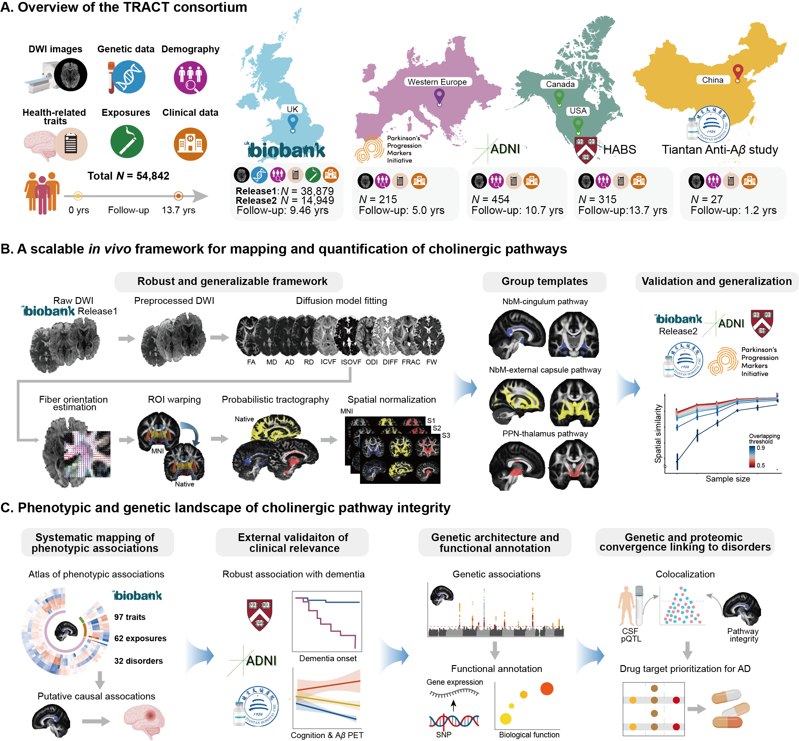

# Cholinergic white matter pathways

The script and derived group templates for major cholinergic pathways in human brain




## 1. Overview

The study integrates data from multiple independent cohorts and uses computational analyses to investigate the genetic and phenotypic architecture of human cholinergic pathways.

The main computational components include:

- Preprocessing and quality control of diffusion-weighted imaging;
- Extraction of imaging phenotypes;
- Cross-sectional analysis;
- Longitudinal analyses;
- Genetic analyses

The code in this repository corresponds to the analyses described in the Methods section of the manuscript.

## 2. System requirements

The analyses were primarily performed in a Linux-based high-performance computing environment. The installation of all required software takes approximately one hour.

### Operating system

```
CentOS Linux >=7
```

### Main software

The principal software used in this study includes:

```
Python: 3.8.18
R: 4.2.0
```

Depending on the analysis, additional software include:

```
PHESANT v1
PLINK v2.0
MTAG v1
MAGMA v1.10
Ensembl VEP 
gProfile 
FIMO v5.5.5
LDSC v1.0.1
```

For neuroimaging analyses, relevant external software include:

```
FSL v6.0.6.5
ANTs v2.4.4
QIT
```

### R dependencies

Major R packages include:

```
data.table v1.14.10
dplyr v1.1.4
tidyr v1.3.0
ggplot2 v4.0.1
survival v3.5.5
lme4 v2.0.1
TwoSampleMR v0.5.8
coloc v5.2.3
ieugwasr v1.1.0
```

## 3. Data availability

This study uses data from established research cohorts and controlled-access resources.

Depending on the analysis, these may include:

- UK Biobank (UKB, https://biobank.ndph.ox.ac.uk/showcase/);
- Alzheimer's Disease Neuroimaging Initiative (ADNI, https://adni.loni.usc.edu/);
- Harvard Aging Brain Study (HABS, https://habs.mgh.harvard.edu);
- Parkinson's Progression Markers Initiative (PPMI, https://www.ppmi-info.org/);
- Tiantan Anti-Amyloid treatment in AD cohort (Tiantan-A3, upon reasonable request).

Participant-level data from these cohorts are subject to their respective data-use agreements and therefore cannot be redistributed by the authors. Researchers wishing to reproduce analyses using these datasets should obtain access directly from the respective data providers.

The summary-level data can be downloaded direction from the corresponding website: 

- The cis-eQTL summary data of brain cortex: https://yanglab.westlake.edu.cn/software/smr/#eQTLsummarydata. 
- The CSF cis-pQTL data: GWAS Catalog (https://www.ebi.ac.uk/gwas/) under accession IDs GCST90421033–GCST90428040. 
- FinnGen summary statistics: r12.finngen.fi; 
- PGC GWAS summary statistics: https://pgc.unc.edu/for-researchers/download-results/.

## 4. Input data

Because raw participant-level data cannot be redistributed, the analysis scripts assume that authorized users have organized their data according to the structures described below.

A typical covariate table should contain one participant per row:

```
participant_id,age,sex,site,eTIV,education,smoking,drinking,BMI,TDI...
s1,62.4,1,site1,1533,1,1,1,18.4,-2.14
s2,68.1,0,site2,1221,2,0,1,19.1,-1.59
...
```

A typical clinical outcome table should contain one participant per row, with a follow-up duration and status:

```
participant_id,time,status
s1,10.5,0
s2,3.5,1
...
```

For analyses requiring imaging data, file paths and naming conventions are documented within the corresponding analysis directory.

```
data/
├── subject_0001/
│   └── unprocessed/
│       └── 3T/
│           └── Diffusion/
│               ├── subject_0001_dwi_PA.nii.gz
│               ├── subject_0001_dwi_AP.nii.gz
│               ├── bvec
│               └── bval
│
├── subject_0002/
│   └── unprocessed/
│       └── 3T/
│           └── Diffusion/
│               ├── subject_0002_dwi_PA.nii.gz
│               ├── subject_0002_dwi_AP.nii.gz
│               ├── bvec
│               └── bval
│
└── ...
```

## 5. Analysis workflow

The main analyses should be performed in the following general order.

### Step 1. Preprocessing and quality control of diffusion-weighted imaging 

```
bash scripts/Preprocessing/UKB_dMRI_HCP4.7.0.sh
```

The UKB_dMRI_HCP4.7.0.sh will invoke UKB_DiffusionPreprocessingBatch.sh and SetUpHCPPipeline.sh. 

These scripts perform preprocessing using the Human Connectome Project Minimal Preprocessing Pipelines. This standardized workflow includes intensity normalization, and correction for susceptibility-induced distortions and eddy-current effects using the topup and eddy tools from FSL (v6.0.6.5). The topup was applied only when opposite phase encoding dwi data was available (including either b0 data or full diffusion MR data). Eddy current correction is computationally intensive when using CPU and can be substantially accelerated with GPU.

The typical running time per subject is approximately one hour on GPU.

OUTPUT: preprocessed diffusion-weighted images.

### Step 2. Microstrucutral modelling, tractography and metric extraction

```
python run_gpu_multimodel_allChoPathways.py \
 --hcp-root absolute_path_of_data_folder \
 --output-root absolute_path_of_output_dir \
 --subjects subject_0001 \
 --gpu-device 0 \
 --stages 1
```

We recommend installing all relevant software within a single Singularity container. This script performs 

- Step1: microstructural modelling (e.g., FA, MD, AD, RD, ICVF, ISOVF, ODI, FW), with a typical running time of approximately 3 hours per subject on CPU;
- Step2: tractography (NbM-originated pathways and PPN-originated pathway), with a typical running time of approximately 30 minutes per subject on GPU;
- Step3: extraction of mean metric in each pathway, with a typical running time of approximately 10 minutes per subject on 1 CPU core;

```
STEP 1: NORMALIZATION & MICROSTRUCTURAL MODELLING
├── Preprocessing: Normalization from native dwi space to standard space
└── Modelling: DTI / NODDI / MCSMT / FW

STEP 2: RECONSTRUCTION & TRACTOGRAPHY
├── Reconstruction: Estimating direction of fibers using bedpostx_gpu
└── Tractography: Probabilistic tractography with probtrackx_gpu

STEP 3: TRACT-SPECIFIC MICROSTRUCTURAL METRICS EXTRACTION
├── 1. Define tracts of interest (ROI / atlas / clustering)
├── 2. Sample microstructural metrics along tracts
└── 3. Calculate average microstructural metrics per tract
```

The reconstruction before tractography takes lots of time using CPU, and can be greatly accelerated by using GPU. 

OUTPUT: a csv file contains Tract × Microstructural Metrics (e.g., FA, MD, ICVF, ISOVF).

### Step 3. Cross-sectional analysis

```
Rscript scripts/Phenotype_analysis/Prevalent.R
```

This script preforms cross-sectional comparsion between patients and healthy controls, where patients were diagnosed prior to the imaging visit.

```
bash scripts/Phenotype_analysis/PHESANT.sh
```

This script preforms cross-sectional assocation analysis between cholinergic white matter integrity and a broad range of health-related traits, 

OUTPUT: Statistics of assocation analysis, including effect coefficients (e.g., beta), se, p value, confidence interval.

### Step 4. Longitudinal analyses

```
Rscript scripts/Phenotype_analysis/Incident.R
```

This script preforms longitudinal survival analysis for the incident of neuropsychiatric disorders, where patients were diagnosed after the imaging visit.

OUTPUT: Statistics of survival analysis, including effect coefficients (e.g., HR), p value, confidence interval.

### Step 5. Genetic analyses

```
bash scripts/Genetic_analysis/GWAS_qc.sh
```

The script performs genome-wide association study for derived cholinergic white matter pathway integrity metrics.

OUTPUT: Statistics of genome-wide association analysis, including effect coefficients (e.g., beta), SE, p value.

```
Rscript scripts/Genetic_analysis/MR_disease.R FA MR_5e6 5e6 
```

The script performs two-sample Mendelian randomization analysis, with cholinergic white matter pathway integrity as exposure and neuropsychiatric disorders as outcome.

OUTPUT: Statistical results from Mendelian randomization analysis, including effect size, standard error, and p-value for each method: inverse-variance weighted (IVW), MR-Egger, weighted median, weighted mode, and Wald ratio.

## 6. Licence

Unless otherwise indicated, the source code in this repository is released under the MIT License and the data contained in this repository is made available under the CC0 1.0 Universal Public Domain Dedication.

Third-party software and datasets remain subject to their original licences and terms of use.

## 7. Contact

For questions regarding the code, please contact Peng Ren; Fudan University; peng.ren.brain@gmail.com; Yuchuan Qiao, Fudan University, yuchuanqiao@fudan.edu.cn

For questions regarding access to controlled datasets, please contact the relevant data provider directly rather than requesting participant-level data from the authors.
